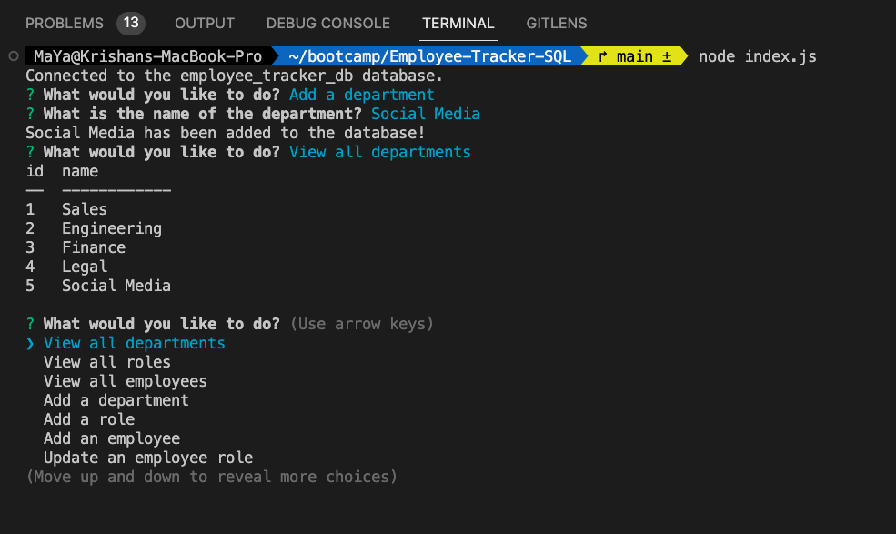

# Employee-Tracker-SQL

## Description

This command line application is designed to manage a company's employee database and provide a user-friendly interface for organizing and planning a business. User will be able to view and manage the departments, roles, and employees in the application. 
Please visit the demo [here](https://drive.google.com/file/d/1hN87534eK7x8bokxwR1QGfXDwkFLsW3N/view?usp=sharing).

## Table of Contents
- [Installation](#installation)
- [Usage](#usage)
- [Credit](#credit)
- [License](#license)

## Installation
1. Clone the repository on your local.
2. To install the packages, run `npm i` on your terminal.
3. Set up the database connection by providing the details in the `db/db.js` file.
4. Run the application using `node index.js` command.

## Usage 
1. Run the application
2. Choose from the given option to perform the action 

3. Follow the prompt and provide the input if needed

4. The application will execute the prompts and display the database.

## Credit
- Assistance from tutor 

- [Bootcamp Gitlab 12-SQL](https://git.bootcampcontent.com/University-of-Adelaide/UADEL-VIRT-FSF-PT-03-2023-U-LOLC/-/tree/main/12-SQL)

## License
Please refer to the LICENSE in the repo.
